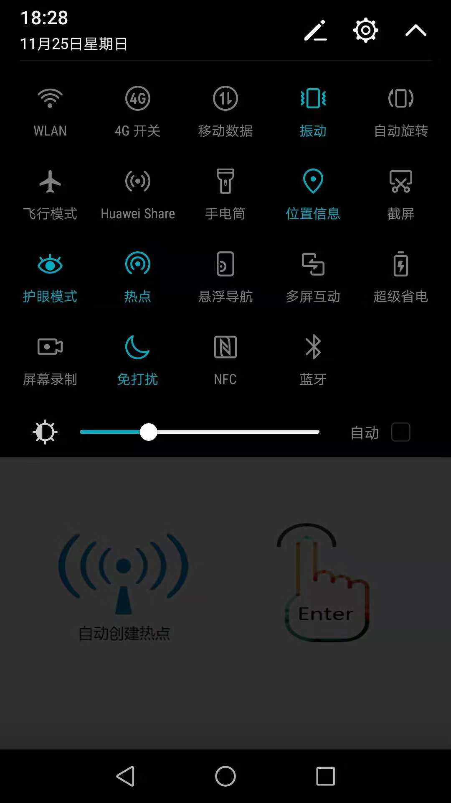
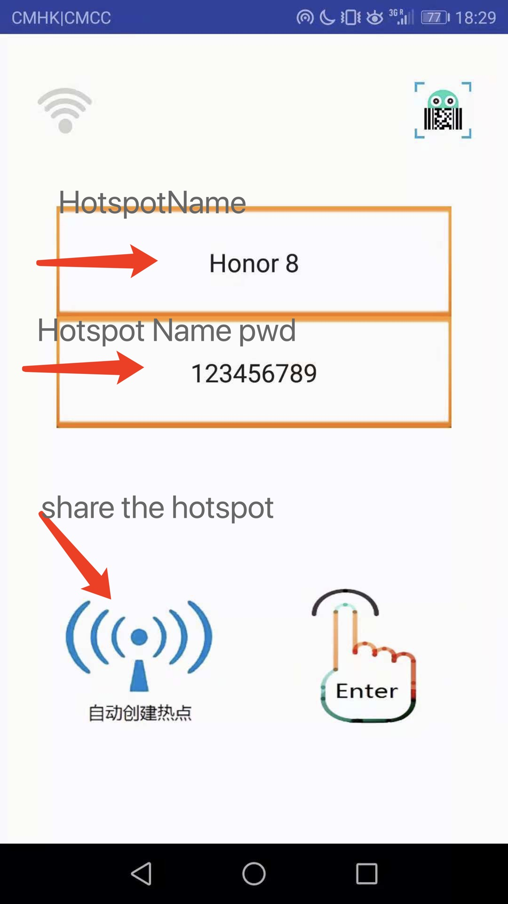
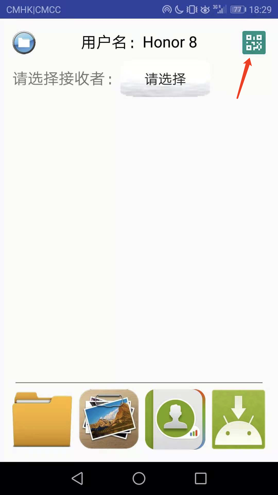
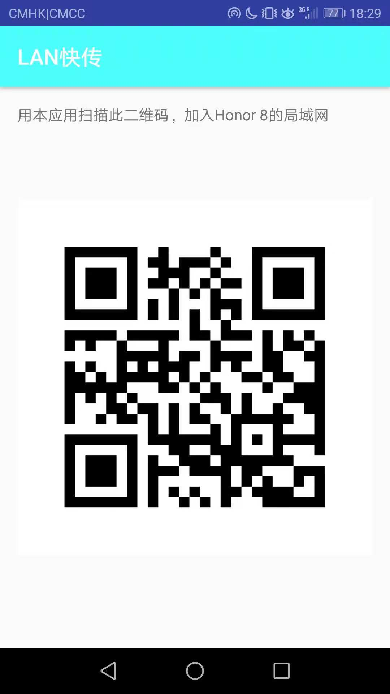
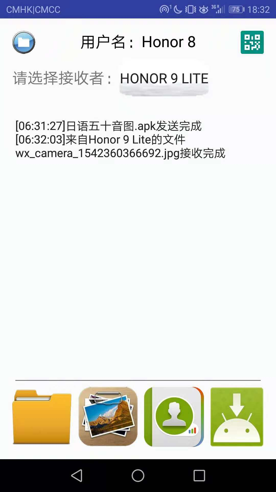
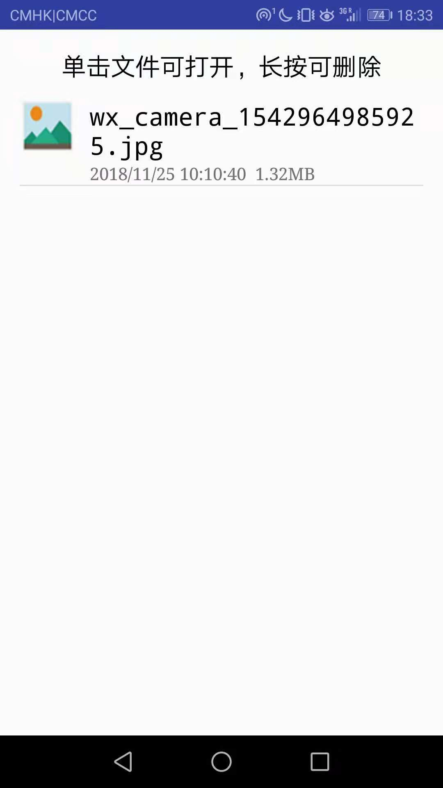

#Readme
This readme file is to introduce the **LAN** android application. The **LAN** is  an application used to transfer files by [LAN](https://en.wikipedia.org/wiki/Local_area_network) technology.

##Environment
Two android smartphones(Smartphone A and Smartphone B,not virtual machine) with LAN function.

##Operation Process
* Both smartphones enter the LAN application.
* Smartphone A turns on its hotspot [manually](https://bbs.csdn.net/topics/392302426?list=lz)(It is difficult to open hotspot automatically after the Android 7.0+ version).
	
* A inputs its own hotspot's name and password and click the openWifi image.(The same reason from above.) Wait until you come into the main interface.
	
* A click the QRcode image on the top right of the main interface to share its hotspot's name and password.
	
	
* B inputs its own name(It can be other name instead of its hotspot's name. This name is used to identify B).
* B click the scan image on the top right of the login interface to scan the QRcode A shared.(If something goes wrong, make sure the app has got the camera permission and disconnected other wifi network)
	
* After the scanning , wait until the wifi logo on the top left turns black. Then B click the finger image to enter the main interface.
	
* A and B can choose receiver from the same LAN and send files. There are 4 kinds of files on the bottom: ordinary files, image files, contacts information and application.
	
	
* You can click the file logo on the top left of main interface to check the files received.
	
	
* In the receive file interface, you can click the file to run or preview it. You can also press a file for long to delete it.